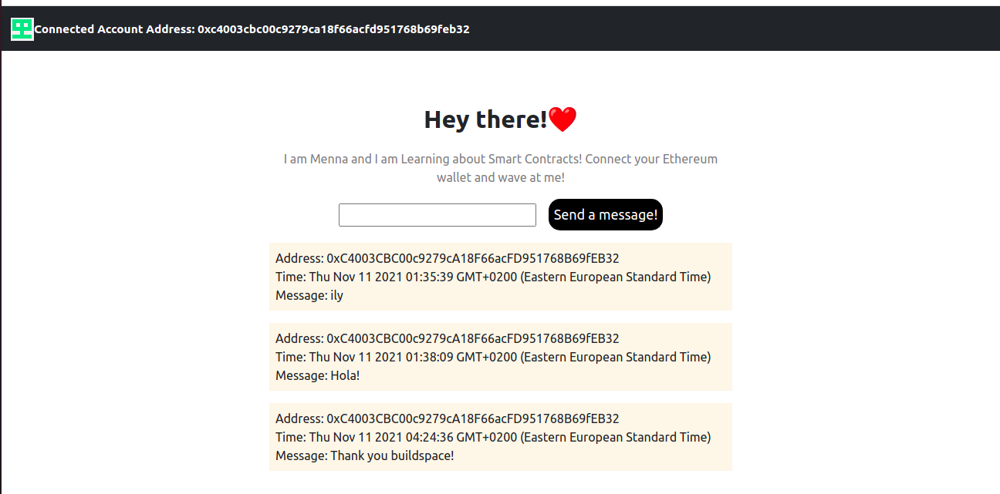

# Simple Wave Portal Dapp (Buildspace First Project)

## Brief:
- I built this project following Buildspace course.(https://buildspace.so/)
- I used Hardhat, ethers.js and deployed on Rinkeby Testnet.
- This dapp lets you connect via metamask, send a message and get a 50% chance to win 0.0001 fake ether.
- It keeps track of all received messages and renders their sender address, timestamp, and text.

## To do:
- Use chainlink VRF to generate the random seed.
  

## Check it on Repl.it:
Link: (https://waveportal-starter-project.mennaabuelnaga.repl.co/)